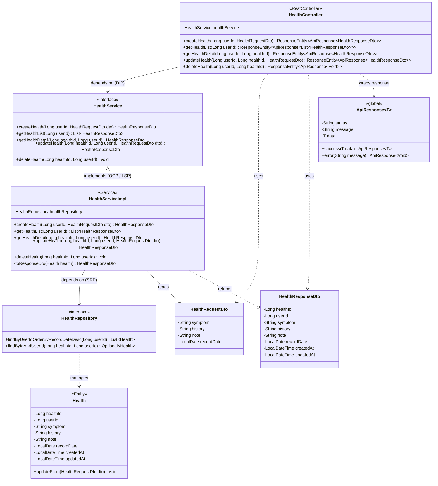

# 프로젝트 개발

자바 17 
프레임워크 스프링 부트
DB mysql
제미나이 API 키 사용예정
환경변수로 처리 부탁
설계 검토 후 계획 수립하고 마크다운내에서 서로 불일치하는 정보나 모순 혹은 문제 유발 점 있으면 기록하고 보고 후 개발착수
자료 참고 필요시 .claude의 소프트웨어공학 설계만 참조
해당파일이 source of truth


## Domain 
- auth : 인증
- member : 회원 CRUD
- health : 건강정보  CRUD - 사용자가 날짜별 증상(symptom), 병력(history), 메모(note)를 기록하는 **핵심 입력 데이터 소스**AI 파이프라인이 해당 데이터를 수집하여 분석에 사용
- prescription : 처방전 CRUD
- ai_result : AI 파이프라인
## 클래스 설계 
### 인증클래스
AuthController.java
- signup()
- login()
- logout()
- getCurrentUser()

AuthService.java
- signup()
- login()
- logout()
- getCurrentUser()

AuthServiceImpl.java
- AuthService 인터페이스 구현체
- 인증 관련 실제 비즈니스 로직 처리

Repository

- UserRepository
- RefreshTokenRepository
Entity

- User
- RefreshToken

DTO

 Auth DTO
- SignupRequestDto
- LoginRequestDto
- LoginResponseDto
- LogoutRequestDto
- UserResponseDto
JWT
Header
Authorization: Bearer {accessToken}

## 멤버클래스

## 3. Controller 계층

#### MemberController.java

POST /api/member/signup
- `SignupRequest`를 입력받아 회원가입을 수행한다.
- 성공 시 `SignupResponse`를 반환한다.
- 실패 시 `DuplicateLoginIdException` 또는 `DuplicateEmailException`을 던진다.

POST /api/member/login
- `LoginRequest`(loginId, password)를 입력받아 인증을 수행한다.
- 성공 시 Access Token을 body로, Refresh Token을 HttpOnly Cookie로 반환한다.
- 실패 시 `InvalidPasswordException`을 던진다.
- 계정 잠금 상태면 `AccountLockedException`을 던진다.

POST /api/member/logout
- Access Token(Authorization 헤더)과 Refresh Token(Cookie)을 입력받는다.
- Refresh Token을 폐기 처리하고 정상 응답을 반환한다.

POST /api/member/token/refresh
- Refresh Cookie로 새 Access Token을 재발급한다.
- 만료/폐기된 Refresh Token이면 인증 실패 응답을 반환한다.

GET /api/member/me
- 인증된 사용자의 식별자를 기반으로 본인 정보를 조회하여 `MemberInfoResponse`를 반환한다.

PUT /api/member/me
- `MemberUpdateRequest`를 입력받아 회원 정보를 수정한다.
- 변경할 필드만 포함하며, 변경 가능 필드는 name, phone, password이다.

POST /api/member/me/verify-password
- `VerifyPasswordRequest`(현재 비밀번호)를 입력받아 본인 확인을 수행한다.
- 성공 시 정상 응답, 실패 시 `InvalidPasswordException`을 던진다.

DELETE /api/member/me
- `WithdrawRequest`(탈퇴 사유)를 입력받아 회원 탈퇴를 처리한다.
- 탈퇴 후 해당 회원의 모든 Refresh Token을 폐기한다.

POST /api/member/find-id
- `FindIdRequest`(name, birthDate)를 입력받아 아이디 찾기를 수행한다.
- 성공 시 마스킹된 login_id를 `FindIdResponse`로 반환한다.

POST /api/member/reset-password
- `ResetPasswordRequest`(loginId, name, birthDate, newPassword)를 입력받아 본인 확인 후 비밀번호를 재설정한다.
- loginId + name + birthDate 조합이 일치하지 않으면 `UserNotFoundException`을 던진다.

---

## 4. Service 계층

#### MemberService.java (인터페이스)
- 컨트롤러가 의존할 인터페이스

#### MemberServiceImpl.java

**회원가입 — signup(SignupRequest)**
1. login_id 중복 여부를 확인한다. 중복 시 `DuplicateLoginIdException`을 던진다.
2. email 중복 여부를 확인한다. 중복 시 `DuplicateEmailException`을 던진다.
3. 비밀번호를 해시 처리하여 저장한다.
4. `status = ACTIVE`로 회원을 생성하고 `SignupResponse`를 반환한다.

**로그인 — login(LoginRequest)**
1. login_id로 사용자를 조회한다. 존재하지 않으면 `InvalidPasswordException`을 던진다.
2. 계정 상태가 잠금/탈퇴 상태인지 확인한다. 잠금 상태면 `AccountLockedException`을 던진다.
3. 비밀번호 해시를 비교한다. 불일치하면 `InvalidPasswordException`을 던진다.
4. 인증 성공 시 Access Token과 Refresh Token을 생성한다.
5. Refresh Token의 해시를 `refresh_token` 테이블에 저장한다.
6. `LoginResponse`(accessToken, name, role 정보)를 반환한다.

**로그아웃 — logout(accessToken, refreshToken)**
1. 해당 Refresh Token 레코드를 조회하여 `revoked = true`로 폐기 처리한다.

**토큰 재발급 — refresh(refreshToken)**
1. Refresh Token 해시로 DB에서 레코드를 조회한다.
2. 폐기 여부(`revoked`), 만료 시각(`expires_at`)을 검증한다.
3. 유효하면 새 Access Token을 발급하여 `TokenRefreshResponse`로 반환한다.

**내 정보 조회 — getMyInfo(userId)**
1. userId로 사용자를 조회한다. 탈퇴 상태인 경우 `UserNotFoundException`을 던진다.
2. `MemberInfoResponse`를 반환한다.

**내 정보 수정 — updateMyInfo(userId, MemberUpdateRequest)**
1. 변경 요청된 필드만 업데이트한다. (name, phone, password)
2. phone 변경 시 중복 여부를 확인한다.
3. password 변경 시 새 비밀번호를 해시 처리하여 저장한다.
4. `updated_at`을 현재 시각으로 갱신한다.

**본인 확인 — verifyPassword(userId, password)**
1. 현재 비밀번호 해시를 비교하여 일치 여부만 반환한다.
2. 불일치 시 `InvalidPasswordException`을 던진다.

**회원 탈퇴 — withdraw(userId, WithdrawRequest)**
1. 계정 상태를 'WITHDRAWN'으로 전환한다.
2. login_id, email을 마스킹 치환하여 UNIQUE 충돌을 회피한다.
3. 해당 회원의 모든 Refresh Token을 일괄 폐기(`revoked = true`)한다.

**아이디 찾기 — findId(FindIdRequest)**
1. name + birthDate 조합으로 사용자를 조회한다.
2. 매칭되는 회원이 있으면 마스킹된 login_id를 `FindIdResponse`로 반환한다. (예: `gild***`)
3. 매칭 실패 시 `UserNotFoundException`을 던진다.

**비밀번호 재설정 — resetPassword(ResetPasswordRequest)**
1. loginId + name + birthDate 조합으로 사용자를 조회한다. 일치하는 회원이 없으면 `UserNotFoundException`을 던진다.
2. 새 비밀번호를 해시 처리하여 덮어쓴다.
3. 보안을 위해 해당 회원의 모든 Refresh Token을 일괄 폐기한다.

---

## 5. Entity 계층

#### User.java
- `users` 테이블과 매핑. PK는 `user_id` (IDENTITY 전략).
- `login_id`, `email` 각각 UNIQUE 제약.
- `status`는 Enum(`UserStatus`)으로 관리하며, `@Enumerated(EnumType.STRING)` 적용.
- `@PrePersist`로 `created_at` 자동 세팅 + `status = ACTIVE` 초기화.
- `@PreUpdate`로 `updated_at` 자동 갱신.
- `gender`는 NULLABLE — 선택 입력 항목.
- `phone`도 NULLABLE — ERD 기준 NOT NULL 제약 없음.

#### RefreshToken.java
- `refresh_token` 테이블과 매핑.
- `user_id`는 `User` 엔티티에 대한 FK (`@ManyToOne` 또는 단순 Long 참조).
- `token_hash` UNIQUE — 원본 토큰은 저장하지 않고 해시만 보관.
- `revoked = false`가 기본값. 로그아웃/탈퇴 시 `true`로 전환.

---

## 6. Repository 계층

#### UserRepository.java
- `findByLoginId(loginId)` → 로그인, 아이디 중복 확인
- `findByEmail(email)` → 이메일 중복 확인
- `findByNameAndBirthDate(name, birthDate)` → 아이디 찾기
- `findByLoginIdAndNameAndBirthDate(loginId, name, birthDate)` → 비밀번호 재설정 본인 확인
- `existsByLoginId(loginId)` → 가입 시 login_id 중복 검증
- `existsByEmail(email)` → 가입 시 email 중복 검증

#### RefreshTokenRepository.java
- `findByTokenHash(hash)` → 토큰 재발급/검증
- `deleteByUserId(userId)` → 탈퇴/비밀번호 재설정 시 전체 폐기

---

## 7. DTO 계층

#### Request DTO

**SignupRequest**
- loginId(필수), password(필수, 규칙 검증), name(필수), email(필수, 형식 검증), phone(선택), birthDate(필수, 과거 일자), gender(선택)

**LoginRequest**
- loginId(필수), password(필수)

**MemberUpdateRequest**
- name(선택), phone(선택), newPassword(선택) — 변경할 필드만 포함

**VerifyPasswordRequest**
- password(필수) — 본인 확인용 현재 비밀번호

**WithdrawRequest**
- reason(선택) — 탈퇴 사유

**FindIdRequest**
- name(필수), birthDate(필수) — 이름+생년월일로 login_id 찾기

**ResetPasswordRequest**
- loginId(필수), name(필수), birthDate(필수), newPassword(필수) — 본인 확인 후 바로 재설정

#### Response DTO

**SignupResponse**
- userId, loginId, message

**LoginResponse**
- accessToken, name — Refresh Token은 body가 아닌 Cookie로 전달

**MemberInfoResponse**
- userId, loginId, name, email, phone, birthDate, gender, createdAt, updatedAt

**FindIdResponse**
- maskedLoginId (예: `user***`)

**TokenRefreshResponse**
- accessToken

**ApiResponse\<T\> **
- status(HTTP 상태 코드), message(결과 메시지), data(T)

---

## 8. JWT 토큰 설계

#### Access Token
- 단기 유효 토큰. 요청 시 `Authorization: Bearer {token}` 헤더로 전달.
- Claims에 사용자 식별자와 역할 정보를 포함한다.
- 만료 시 Refresh Token으로 재발급을 시도한다.

#### Refresh Token
- 장기 유효 토큰. HttpOnly + Secure Cookie로 전달 (XSS 방어).
- DB(`refresh_token` 테이블)에 해시만 저장, 원본은 클라이언트 Cookie에만 존재.
- 로그아웃/탈퇴/비밀번호 재설정 시 `revoked = true`로 폐기.

#### JwtTokenProvider.java (util)
- 토큰 생성, 파싱, 서명 검증을 담당한다.
- 비밀키는 설정 파일의 환경변수로 주입한다.

#### SecurityConfig.java (global.config)
- JWT 인증 필터를 Security Filter Chain에 삽입한다.
- 인증 불필요 엔드포인트: `/signup`, `/login`, `/find-id`, `/reset-password`
- 그 외 엔드포인트는 인증된 사용자만 접근 가능하다.

---

## 9. Exception 계층

**(도메인별 예외를 정의, 전역 핸들러에서 `ApiResponse` 형식으로 일관된 에러 반환)**

- `UserNotFoundException` → 존재하지 않는 회원 (탈퇴 포함)
- `DuplicateLoginIdException` → login_id 중복
- `DuplicateEmailException` → email 중복
- `InvalidPasswordException` → 비밀번호 불일치
- `AccountLockedException` → 잠금 상태 계정 접근 시도
- `GlobalExceptionHandler` → `@RestControllerAdvice`로 전역 처리

---

## 10. Enum 정의

#### UserStatus
- `ACTIVE` — 활성 (ERD 기본값)
- `LOCKED` — 잠금
- `WITHDRAWN` — 탈퇴
- 
  멤버클래스끝


## 건강클래스


건강끝

## 처방클래스

#### PrescriptionController.java
(클라이언트 요청 처리)
POST /api/prescription/create -> 처방전 및 처방약 정보를 입력받아 생성 요청을 처리한다.
GET /api/prescription/list -> 로그인된 사용자의 처방전 목록을 조회한다.
GET /api/prescription/{prescription_id} -> 특정 처방전의 상세 정보를 조회한다.
PUT /api/prescription/update/{prescription_id} -> 기존 처방전 정보를 수정한다.
DELETE /api/prescription/delete/{prescription_id} -> 처방전 정보를 삭제 상태로 변경한다.

#### PrescriptionService.java
(기능 정의)
- createPrescription() → 처방전 생성
- getPrescriptionList() → 처방전 목록 조회
- getPrescriptionDetail() → 처방전 상세 조회
- updatePrescription() → 처방전 수정
- deletePrescription() → 처방전 삭제

#### PrescriptionServiceImpl.java
(실제 로직 처리)
- 처방전 생성 요청 시 필수 입력값(처방일, 병원명, 약 정보 등)을 검증한다.
- 사용자 ID를 기반으로 처방전 데이터를 생성하고 저장한다.
- 처방약 정보가 여러 개인 경우 반복 처리하여 각각 저장한다.
- 처방전 조회 시 사용자 ID 기준으로 데이터 필터링을 수행한다.
- 처방전 목록 조회 시 최신순으로 정렬하여 반환한다.
- 특정 처방전 조회 시 처방전 정보와 처방약 목록을 함께 조회한다.
- 처방전 수정 시 기존 데이터를 조회한 후 입력값으로 업데이트한다.
- 처방약 정보 수정 시 기존 데이터를 제거 후 재등록한다.
- 삭제 요청 시 실제 삭제가 아닌 상태값(status)을 DELETED로 변경한다.
- 존재하지 않는 처방전 요청 시 예외를 처리한다.
- 사용자 권한이 없는 데이터 접근 시 예외를 처리한다.

#### PrescriptionRepository.java
(DB 접근)
- prescription 테이블에 대한 CRUD 수행
- 사용자 ID 기반 처방전 조회
- 상태값 기준 필터링 조회

#### PrescriptionDetailRepository.java
(DB 접근)
- prescription_detail 테이블에 대한 CRUD 수행
- prescription_id 기준 처방약 목록 조회

#### Entity
- Prescription
- prescription_id
- user_id
- prescription_date
- hospital_name
- status
- created_at
- updated_at
- PrescriptionDetail
- detail_id
- prescription_id
- medicine_name
- dosage
- duration
- created_at
- updated_at

#### DTO
- PrescriptionRequestDto
- prescriptionDate
- hospitalName
- medicineList (약 정보 리스트)
- PrescriptionResponseDto
- prescriptionId
- prescriptionDate
- hospitalName
- medicineList

#### Exception Handling
- 필수값 누락 시 예외 처리
- 존재하지 않는 처방전 조회 시 예외 처리
- 권한 없는 접근 시 예외 처리
- 잘못된 입력값 형식에 대한 예외 처리

#### Notes
- 처방전과 처방약은 1 관계로 관리한다.
- 삭제는 Soft Delete 방식으로 처리한다.
- 모든 데이터는 사용자 기준으로 관리된다.

처방클래스끝

## AI클래스


##### AiController.java
(클라이언트 요청 처리)
- POST /api/ai/trigger         → 사용자가 특정 사용자의 AI 분석을 수동 실행한다.
- GET  /api/ai/result/me → 해당 사용자의 최신 AI 분석 결과 전체를 반환한다.
- GET  /api/ai/result/me/summary       → 요약 항목(health_status, summary_note, analysis_date)만 반환한다.
- GET  /api/ai/result/me/diseases      → potential_diseases(JSON 배열) 반환한다.
- GET  /api/ai/result/me/foods         → recommended_foods(JSON 배열) 반환한다.
- GET  /api/ai/result/me/exercises     → recommended_exercises(JSON 배열) 반환한다.
- GET  /api/ai/result/me/precautions   → precautions(text) 반환한다.

##### AiDomainService.java (인터페이스)
Controller가 직접 의존하는 파사드 서비스.
- triggerAnalysis(Long userId) → 분석 전체 파이프라인 조율
- getLatestResult(Long userId) → 최신 결과 단건 조회
- getSummary / getDiseases / getFoods / getExercises / getPrecautions → 개별 항목 조회

##### AiDomainServiceImpl.java
AiDomainService의 구현체.
- AiDatasetService, AiResultService, AiResultRepository에 의존한다.
- triggerAnalysis 흐름:
    1. AiDatasetService로 CSV 데이터셋 생성
    2. AiResultService로 LLM 호출 및 파싱
    3. AiResultRepository로 ai_result 테이블에 저장

##### AiResultService.java (인터페이스)
LLM 공급자(Claude, OpenAI 등) 교체 가능성을 고려한 추상화 레이어.
- analyze(AiResultRequestDTO request) → AiResultResponseDTO

##### AiResultServiceImpl.java
AiResultService의 구현체. 실제 LLM API 호출 및 응답 파싱 담당.
- CSV 데이터와 프롬프트를 조합하여 LLM API에 요청을 전송한다.
- 응답 JSON을 AiResultResponseDTO로 역직렬화한다.
- raw_llm_response에 LLM 원본 응답을 보존한다.
- LLM 호출 실패 시 최대 3회 재시도(Exponential Backoff: 1s → 2s → 4s).

##### AiDatasetService.java (구현체, 인터페이스 없음)
userId 기반으로 health / prescription / prescription_detail 레포지토리에서 데이터를 수집하고
LLM에 전달할 CSV 형식의 AiResultRequestDTO를 생성한다.

```
[health]
health_id,symptom,history,note,record_date
1,"두통,피로감","고혈압 가족력","최근 수면 부족","2026-04-01"

[prescription]
prescription_id,prescription_date,hospital_name
10,"2026-03-20","서울내과"

[prescription_detail]
detail_id,prescription_id,medicine_name,dosage,duration
20,10,"암로디핀","1일 1회 1정","30일"
```

##### AiResultRepository.java
ai_result 테이블에 대한 CRUD 수행.
- findTopByUserIdOrderByAnalysisDateDesc(Long userId) → 최신 결과 단건 조회

##### AiResultEntity.java
ai_result 테이블 매핑.

| 컬럼 | 타입 | 설명 |
|------|------|------|
| result_id | int (PK) | 자동 증가 |
| user_id | bigint | FK → users.user_id |
| health_status | varchar(20) | GOOD / CAUTION / WARNING |
| summary_note | text | 종합 건강 요약 문장 |
| potential_diseases | json | 추정 질환 목록 (String 배열) |
| recommended_foods | json | 권장 식품 목록 (String 배열) |
| recommended_exercises | json | 권장 운동 목록 (String 배열) |
| precautions | text | 주의사항 서술 |
| analysis_date | datetime | 분석 실행 일시 |
| raw_llm_response | json | LLM 원본 응답 보존 |

##### AiResultResponseDTO.java
LLM 응답 JSON 역직렬화 및 클라이언트 응답에 사용.
```java
Long    resultId
Long    userId
String  healthStatus        // "GOOD" | "CAUTION" | "WARNING"
String  summaryNote
List<String> potentialDiseases
List<String> recommendedFoods
List<String> recommendedExercises
String  precautions
String  analysisDate        // ISO 8601
```

##### AiResultRequestDTO.java
AiDatasetService가 생성하는 CSV 래퍼 DTO.
```java
Long   userId
String healthCsv            // health 테이블 CSV 문자열
String prescriptionCsv      // prescription + prescription_detail 조인 CSV
```

---

#### 프롬프트 엔지니어링 (AiResultServiceImpl)

**시스템 프롬프트**
```
당신은 환자의 건강 데이터를 분석하는 의료 AI 어시스턴트입니다.
아래 지침을 엄격히 따르십시오.
1. 응답은 반드시 순수 JSON 객체 하나만 출력하십시오. 설명 문장, 마크다운 코드블록, 전후 공백을 절대 포함하지 마십시오.
2. 필드 이름과 타입은 아래 스키마를 정확히 따르십시오.
3. 배열 필드는 최대 5개 항목으로 제한하십시오.
4. health_status 값은 GOOD / CAUTION / WARNING 중 하나만 사용하십시오.
```

**유저 프롬프트 (템플릿)**
```
다음은 환자의 최근 건강 기록 및 처방 데이터입니다.

[건강 기록 CSV]
{healthCsv}

[처방 데이터 CSV]
{prescriptionCsv}

위 데이터를 분석하여 아래 JSON 스키마에 맞는 결과를 반환하십시오.

{
  "health_status": "GOOD | CAUTION | WARNING",
  "summary_note": "한국어 종합 건강 요약 (2~4문장)",
  "potential_diseases": ["질환명1", "질환명2"],
  "recommended_foods": ["식품1", "식품2"],
  "recommended_exercises": ["운동1", "운동2"],
  "precautions": "한국어 주의사항 (1~3문장)"
}
```

---

#### 오류 처리 전략

| 상황 | 처리 방식 |
|------|----------|
| AI 응답 JSON 파싱 실패 | raw_llm_response에 원본 저장 후 예외를 던져 트랜잭션 롤백 |
| ai_result 저장 실패 | 트랜잭션 롤백으로 부분 저장 방지 |
| 존재하지 않는 userId 트리거 | 404 예외 반환 |
| 권한 없는 접근 (일반 사용자가 타인 결과 조회) | 403 예외 반환 |
| 분석 결과 없음 | 204 No Content 반환 |


---

## API 설계

## auth-Domain

- POST /api/auth/signup → 회원가입
- POST /api/auth/login → 로그인
- POST /api/auth/logout → 로그아웃
- GET /api/auth/me → 사용자 정보 조회


## member-Domain
 1. 회원가입 `POST /api/member/signup`

**인증:** 불필요

**Request Body**
| 필드 | 타입 | 필수 | 설명 |
|---|---|---|---|
| loginId | String | O | 로그인 아이디 (UNIQUE, 최대 50자) |
| password | String | O | 비밀번호 (영문+숫자+특수문자 8자↑) |
| name | String | O | 이름 (최대 50자) |
| email | String | O | 이메일 (UNIQUE) |
| phone | String | X | 전화번호 |
| birthDate | String | O | 생년월일 (YYYY-MM-DD) |
| gender | String | X | 성별 (M/F) |

```json
// Request
{
  "loginId": "gildongi2003",
  "password": "Abcd1234!",
  "name": "홍길동",
  "email": "test@gachon.ac.kr",
  "phone": "010-1234-5678",
  "birthDate": "2003-05-10",
  "gender": "M"
}

// Response 200
{
  "status": 200,
  "message": "회원가입 완료",
  "data": {
    "userId": 12,
    "loginId": "gildongi2003",
    "message": "가입이 정상적으로 처리되었습니다."
  }
}
```

**Error:** 409 login_id 중복 / 409 email 중복 / 400 Validation 실패

---

### 2. 로그인 `POST /api/member/login`

**인증:** 불필요

**Request Body**
| 필드 | 타입 | 필수 | 설명 |
|---|---|---|---|
| loginId | String | O | 로그인 아이디 |
| password | String | O | 비밀번호 |

```json
// Request
{ "loginId": "parang2003", "password": "Abcd1234!" }

// Response 200 (+ Set-Cookie: refreshToken=...; HttpOnly; Secure)
{
  "status": 200,
  "message": "로그인 성공",
  "data": {
    "accessToken": "eyJhbGciOiJIUzI1NiJ9...",
    "name": "김팔랑"
  }
}
```

**Error:** 401 비밀번호 불일치 / 423 계정 잠금 / 404 존재하지 않는 아이디

---

### 3. 로그아웃 `POST /api/member/logout`

**인증:** Access Token 필수

**Request Header:** `Authorization: Bearer {accessToken}` + Cookie: `refreshToken=...`

```json
// Response 200 (+ Set-Cookie: refreshToken=; Max-Age=0)
{ "status": 200, "message": "로그아웃 되었습니다.", "data": null }
```

---

### 4. 토큰 재발급 `POST /api/member/token/refresh`

**인증:** Refresh Cookie 필수

```json
// Response 200 (+ 새 Refresh Cookie 발급)
{
  "status": 200,
  "message": "토큰 재발급 성공",
  "data": { "accessToken": "eyJhbGciOiJIUzI1NiJ9..." }
}
```

**Error:** 401 Refresh 만료/폐기

---

### 5. 내 정보 조회 `GET /api/member/me`

**인증:** Access Token 필수

```json
// Response 200
{
  "status": 200,
  "message": "조회 성공",
  "data": {
    "userId": 12,
    "loginId": "parang2003",
    "name": "김팔랑",
    "email": "test@gachon.ac.kr",
    "phone": "010-1234-5678",
    "birthDate": "2003-05-10",
    "gender": "M",
    "createdAt": "2026-04-10T14:22:01",
    "updatedAt": "2026-04-12T09:10:45"
  }
}
```

---

### 6. 본인 확인 `POST /api/member/me/verify-password`

**인증:** Access Token 필수

```json
// Request
{ "password": "Abcd1234!" }

// Response 200
{ "status": 200, "message": "본인 확인 성공", "data": null }
```

**Error:** 401 비밀번호 불일치

---

### 7. 내 정보 수정 `PUT /api/member/me`

**인증:** Access Token 필수

**Request Body** (변경할 필드만 넣어놓았습니다.)
| 필드 | 타입 | 필수 | 설명 |
|---|---|---|---|
| name | String | X | 이름 |
| phone | String | X | 전화번호 |
| newPassword | String | X | 새 비밀번호 |

```json
// Request
{ "name": "홍건적(개명)", "newPassword": "Newpass1234!" }

// Response 200
{ "status": 200, "message": "회원 정보가 수정되었습니다.", "data": null }
```

**Error:** 400 Validation 실패

---

### 8. 회원 탈퇴 `DELETE /api/member/me`

**인증:** Access Token 필수

```json
// Request
{ "reason": "서비스를 자주 이용하지 않습니다." }

// Response 200
{ "status": 200, "message": "회원 탈퇴가 완료되었습니다.", "data": null }
```

---

### 9. 아이디 찾기 `POST /api/member/find-id`

**인증:** 불필요

**Request Body**
| 필드 | 타입 | 필수 | 설명 |
|---|---|---|---|
| name | String | O | 가입 시 등록한 이름 |
| birthDate | String | O | 생년월일 (YYYY-MM-DD) |

```json
// Request
{ "name": "홍길동", "birthDate": "2003-05-10" }

// Response 200
{
  "status": 200,
  "message": "아이디 찾기 성공",
  "data": { "maskedLoginId": "gild*******" }
}
```

**Error:** 404 일치하는 회원 없음

---

### 10. 비밀번호 재설정 `POST /api/member/reset-password`

**인증:** 불필요

**Request Body**
| 필드 | 타입 | 필수 | 설명 |
|---|---|---|---|
| loginId | String | O | 로그인 아이디 |
| name | String | O | 가입 시 등록한 이름 |
| birthDate | String | O | 생년월일 (YYYY-MM-DD) |
| newPassword | String | O | 새 비밀번호 |

```json
// Request
{
  "loginId": "gildong2003",
  "name": "홍길동",
  "birthDate": "2003-05-10",
  "newPassword": "Newpass1234!"
}

// Response 200
{ "status": 200, "message": "비밀번호가 재설정되었습니다.", "data": null }
```

**Error:** 404 loginId+name+birthDate 불일치 / 400 Validation 실패

---

인증 헤더 요약

| API 구분 | Access Token | Refresh Cookie |
|---|---|---|
| 공개 (signup, login, find-id, reset-password) | X | X |
| 인증 (me, verify-password, logout) | O | X |
| 토큰 재발급 (token/refresh) | X | O |

---

요구사항과 API 매핑(요구사항 설계 당시 짠 유스케이스 명세서 기준)

| 요구사항 | API | UC |
|---|---|---|
| FR-01 회원가입 | POST /api/member/signup | UC-A03 |
| FR-02 로그인 | POST /api/member/login, POST /api/member/token/refresh | UC-A01 |
| FR-03 로그아웃 | POST /api/member/logout | UC-A02 |
| FR-04 정보 조회 | GET /api/member/me | UC-A04 |
| FR-05 정보 수정 | POST /api/member/me/verify-password → PUT /api/member/me | UC-A05 |
| FR-06 회원 탈퇴 | POST /api/member/me/verify-password → DELETE /api/member/me | UC-A06 |
| FR-07 아이디/비밀번호 찾기 | POST /find-id, /reset-password | UC-A07 |

## health-domain

### 6-1. 건강 기록 생성

```
POST /api/health/create
```

**Request Body**
```json
{
  "symptom": "두통, 발열",
  "history": "고혈압 병력",
  "note": "어제부터 시작됨",
  "recordDate": "2026-05-01"
}
```

| 필드 | 타입 | 필수 | 설명 |
|------|------|------|------|
| symptom | String | Y | 주요 증상 |
| history | String | N | 과거 병력 |
| note | String | N | 추가 메모 |
| recordDate | LocalDate | Y | 증상 날짜 (yyyy-MM-dd) |

**Response `201 Created`**
```json
{
  "status": "success",
  "message": "건강 기록이 생성되었습니다.",
  "data": {
    "healthId": 1,
    "userId": 42,
    "symptom": "두통, 발열",
    "history": "고혈압 병력",
    "note": "어제부터 시작됨",
    "recordDate": "2026-05-01",
    "createdAt": "2026-05-01T10:00:00",
    "updatedAt": null
  }
}
```

**Error**
| 상태 코드 | 사유 |
|-----------|------|
| 400 | symptom 또는 recordDate 누락 |
| 401 | 인증 토큰 없음 또는 만료 |

---

### 6-2. 건강 기록 목록 조회

```
GET /api/health/list
```

**Response `200 OK`**
```json
{
  "status": "success",
  "message": "건강 기록 목록 조회 성공",
  "data": [
    {
      "healthId": 2,
      "userId": 42,
      "symptom": "기침",
      "history": null,
      "note": null,
      "recordDate": "2026-04-30",
      "createdAt": "2026-04-30T09:00:00",
      "updatedAt": null
    },
    {
      "healthId": 1,
      "userId": 42,
      "symptom": "두통, 발열",
      "history": "고혈압 병력",
      "note": "어제부터 시작됨",
      "recordDate": "2026-05-01",
      "createdAt": "2026-05-01T10:00:00",
      "updatedAt": null
    }
  ]
}
```

- 정렬: `record_date DESC`
- 본인 데이터만 반환

---

### 6-3. 건강 기록 단건 조회

```
GET /api/health/{healthId}
```

**Response `200 OK`**
```json
{
  "status": "success",
  "message": "건강 기록 조회 성공",
  "data": {
    "healthId": 1,
    "userId": 42,
    "symptom": "두통, 발열",
    "history": "고혈압 병력",
    "note": "어제부터 시작됨",
    "recordDate": "2026-05-01",
    "createdAt": "2026-05-01T10:00:00",
    "updatedAt": null
  }
}
```

**Error**
| 상태 코드 | 사유 |
|-----------|------|
| 404 | 존재하지 않는 기록 또는 타인 소유 |

---

### 6-4. 건강 기록 수정

```
PUT /api/health/update/{healthId}
```

**Request Body** *(변경할 필드만 포함 가능)*
```json
{
  "symptom": "두통 완화, 발열 지속",
  "history": "고혈압 병력",
  "note": "해열제 복용 후 호전",
  "recordDate": "2026-05-01"
}
```

**Response `200 OK`**
```json
{
  "status": "success",
  "message": "건강 기록이 수정되었습니다.",
  "data": {
    "healthId": 1,
    "userId": 42,
    "symptom": "두통 완화, 발열 지속",
    "history": "고혈압 병력",
    "note": "해열제 복용 후 호전",
    "recordDate": "2026-05-01",
    "createdAt": "2026-05-01T10:00:00",
    "updatedAt": "2026-05-01T14:30:00"
  }
}
```

**Error**
| 상태 코드 | 사유 |
|-----------|------|
| 400 | symptom 또는 recordDate 누락 |
| 404 | 존재하지 않는 기록 또는 타인 소유 |

---

### 6-5. 건강 기록 삭제

```
DELETE /api/health/delete/{healthId}
```

**Response `200 OK`**
```json
{
  "status": "success",
  "message": "건강 기록이 삭제되었습니다.",
  "data": null
}
```

**Error**
| 상태 코드 | 사유 |
|-----------|------|
| 404 | 존재하지 않는 기록 또는 타인 소유 |


## Prescription-Domain
1. 처방전 생성
- URL: POST /api/prescription/create
  (설명: 처방전 및 처방약 정보를 등록한다.)

- Request
  {
  "prescriptionDate": "2026-04-26",
  "hospitalName": "서울병원",
  "medicineList": [
  {
  "medicineName": "타이레놀",
  "dosage": "1일 2회",
  "duration": "5일"
  }
  ]
  }

- Response
  {
  "prescriptionId": 1,
  "message": "처방전이 생성되었습니다."
  }

(예외)
- 필수값 누락 시 요청 실패
- 잘못된 데이터 형식 입력 시 실패

2. 처방전 목록 조회
- URL: GET /api/prescription/list
  (설명: 로그인된 사용자의 처방전 목록을 조회한다.)

- Response
  [
  {
  "prescriptionId": 1,
  "prescriptionDate": "2026-04-26",
  "hospitalName": "서울병원"
  }
  ]

(예외)
- 인증되지 않은 사용자 접근 시 실패

3. 처방전 상세 조회
- URL: GET /api/prescription/{prescription_id}
  (설명: 특정 처방전의 상세 정보를 조회한다.)

- Response
  {
  "prescriptionId": 1,
  "prescriptionDate": "2026-04-26",
  "hospitalName": "서울병원",
  "medicineList": [
  {
  "medicineName": "타이레놀",
  "dosage": "1일 2회",
  "duration": "5일"
  }
  ]
  }

(예외)
- 존재하지 않는 처방전 조회 시 실패

4. 처방전 수정
- URL: PUT /api/prescription/update/{prescription_id}
  (설명: 기존 처방전 정보를 수정한다.)

- Request
  {
  "prescriptionDate": "2026-04-27",
  "hospitalName": "강남병원",
  "medicineList": [
  {
  "medicineName": "항생제",
  "dosage": "1일 3회",
  "duration": "7일"
  }
  ]
  }

- Response
  {
  "message": "처방전이 수정되었습니다."
  }

(예외)
- 존재하지 않는 처방전 수정 시 실패
- 권한 없는 사용자 접근 시 실패

5. 처방전 삭제
- URL: DELETE /api/prescription/delete/{prescription_id}
  (설명: 처방전을 삭제 상태로 변경한다.)

- Response
  {
  "message": "처방전이 삭제되었습니다."
  }

(예외)
- 존재하지 않는 처방전 삭제 시 실패
- 권한 없는 사용자 접근 시 실패

## AI-Domain


### 1. AI 분석 트리거 

- **URL**: `POST /api/ai/trigger`
- **설명**: 사용자가 자신 최신 건강·처방 데이터를 LLM에 전달하여 AI 분석을 실행하고 결과를 저장한다. 동기 처리.


**Request Header**
```
Authorization: Bearer {accessToken}
Content-Type: application/json
```

**Request Body**
```json
{
  "userId": 42
}
```

| 필드 | 타입 | 필수 | 설명 |
|------|------|------|------|
| userId | Long | Y | 분석 대상 사용자 ID |

**Response (200 OK)**
```json
{
  "resultId": 15,
  "userId": 42,
  "healthStatus": "CAUTION",
  "summaryNote": "최근 두통과 피로감이 지속되고 있으며, 고혈압 관련 약물을 복용 중입니다. 생활 습관 개선과 정기 검진이 권장됩니다.",
  "potentialDiseases": ["고혈압", "만성피로증후군"],
  "recommendedFoods": ["바나나", "견과류", "브로콜리"],
  "recommendedExercises": ["걷기", "스트레칭"],
  "precautions": "카페인 섭취를 줄이고 충분한 수면을 취하십시오. 혈압 변동이 심할 경우 즉시 병원을 방문하십시오.",
  "analysisDate": "2026-04-28T10:30:00"
}
```

**예외**

| 상황 | HTTP 코드 | 메시지 |
|------|----------|--------|
| 존재하지 않는 userId | 404 | "해당 사용자를 찾을 수 없습니다." |
| LLM API 3회 재시도 실패 | 502 | "AI 분석 서비스에 일시적인 오류가 발생했습니다. 잠시 후 다시 시도해주세요." |
| AI 응답 파싱 실패 | 500 | "AI 응답 처리 중 오류가 발생했습니다." |
| 권한 없음 (비관리자) | 403 | "접근 권한이 없습니다." |

---

#### 2. AI 분석 결과 전체 조회

- **URL**: `GET /api/ai/result/me`
- **설명**: 해당 사용자의 가장 최근 AI 분석 결과 전체를 반환한다.
- **권한**: 본인 또는 ADMIN

**Request Header**
```
Authorization: Bearer {accessToken}
```

**Path Parameter**

| 파라미터 | 타입 | 설명 |
|---------|------|------|
| userId | Long | 조회 대상 사용자 ID |

**Response (200 OK)**
```json
{
  "resultId": 15,
  "userId": 42,
  "healthStatus": "CAUTION",
  "summaryNote": "최근 두통과 피로감이 지속되고 있으며, 고혈압 관련 약물을 복용 중입니다. 생활 습관 개선과 정기 검진이 권장됩니다.",
  "potentialDiseases": ["고혈압", "만성피로증후군"],
  "recommendedFoods": ["바나나", "견과류", "브로콜리"],
  "recommendedExercises": ["걷기", "스트레칭"],
  "precautions": "카페인 섭취를 줄이고 충분한 수면을 취하십시오. 혈압 변동이 심할 경우 즉시 병원을 방문하십시오.",
  "analysisDate": "2026-04-28T10:30:00"
}
```

**예외**

| 상황 | HTTP 코드 | 메시지 |
|------|----------|--------|
| 분석 결과 없음 | 204 | (body 없음) |
| 존재하지 않는 userId | 404 | "해당 사용자를 찾을 수 없습니다." |
| 타인 데이터 접근 | 403 | "접근 권한이 없습니다." |

---

##### 3. 건강 요약 조회

- **URL**: `GET /api/ai/result/me/summary`
- **설명**: health_status, summary_note, analysis_date만 반환한다. 메인 대시보드 카드 위젯에 사용.


**Response (200 OK)**
```json
{
  "healthStatus": "CAUTION",
  "summaryNote": "최근 두통과 피로감이 지속되고 있으며, 고혈압 관련 약물을 복용 중입니다. 생활 습관 개선과 정기 검진이 권장됩니다.",
  "analysisDate": "2026-04-28T10:30:00"
}
```

**healthStatus 값 정의**

| 값 | 의미 |
|----|------|
| GOOD | 건강 상태 양호 |
| CAUTION | 주의 필요 |
| WARNING | 위험, 즉각 조치 권장 |

---

##### 4. 추정 질환 목록 조회

- **URL**: `GET /api/ai/result/me/diseases`
- **설명**: potential_diseases 배열만 반환한다.


**Response (200 OK)**
```json
{
  "potentialDiseases": ["고혈압", "만성피로증후군"]
}
```

---

##### 5. 권장 식품 목록 조회

- **URL**: `GET /api/ai/result/me/foods`
- **설명**: recommended_foods 배열만 반환한다.


**Response (200 OK)**
```json
{
  "recommendedFoods": ["바나나", "견과류", "브로콜리"]
}
```

---

##### 6. 권장 운동 목록 조회

- **URL**: `GET /api/ai/result/me/exercises`
- **설명**: recommended_exercises 배열만 반환한다.


**Response (200 OK)**
```json
{
  "recommendedExercises": ["걷기", "스트레칭"]
}
```

---

##### 7. 주의사항 조회

- **URL**: `GET /api/ai/result/me/precautions`
- **설명**: precautions 텍스트만 반환한다.


**Response (200 OK)**
```json
{
  "precautions": "카페인 섭취를 줄이고 충분한 수면을 취하십시오. 혈압 변동이 심할 경우 즉시 병원을 방문하십시오."
}
```

---


## ERD

Table users {
user_id    bigint      [pk, increment]
login_id   varchar(50) [unique, not null]
password   varchar(255) [not null]
name       varchar(50) [not null]
email      varchar(100) [unique, not null]
phone      varchar(20)
birth_date date        [not null]
gender     char(1)
status     varchar(10) [not null, default: 'ACTIVE']
created_at datetime    [not null, default: `now()`]
updated_at datetime
}

Table refresh_token {
token_id   bigint      [pk, increment]
user_id    bigint      [not null, ref: > users.user_id]
token_hash varchar(255) [unique, not null]
expires_at datetime    [not null]
revoked    boolean     [not null, default: false]
created_at datetime    [not null, default: `now()`]
}

Table health {
health_id   bigint   [pk, increment]
user_id     bigint   [not null, ref: > users.user_id]
symptom     text     [not null]
history     text
note        text
record_date date     [not null]
created_at  datetime [not null, default: `now()`]
updated_at  datetime
}

Table prescription {
prescription_id   bigint      [pk, increment]
user_id           bigint      [not null, ref: > users.user_id]
prescription_date date        [not null]
hospital_name     varchar(100) [not null]
status            varchar(10) [not null, default: 'ACTIVE']
created_at        datetime    [not null, default: `now()`]
updated_at        datetime
}

Table prescription_detail {
detail_id       bigint      [pk, increment]
prescription_id bigint      [not null, ref: > prescription.prescription_id]
medicine_name   varchar(100) [not null]
dosage          varchar(50) [not null]
duration        varchar(50) [not null]
created_at      datetime    [not null, default: `now()`]
updated_at      datetime
}

Table ai_result {
result_id             int      [pk, increment]
user_id               bigint   [not null, ref: > users.user_id]
health_status         varchar(20) [not null]
summary_note          text     [not null]
potential_diseases    json
recommended_foods     json
recommended_exercises json
precautions           text
analysis_date         datetime [not null]
raw_llm_response      json
}
